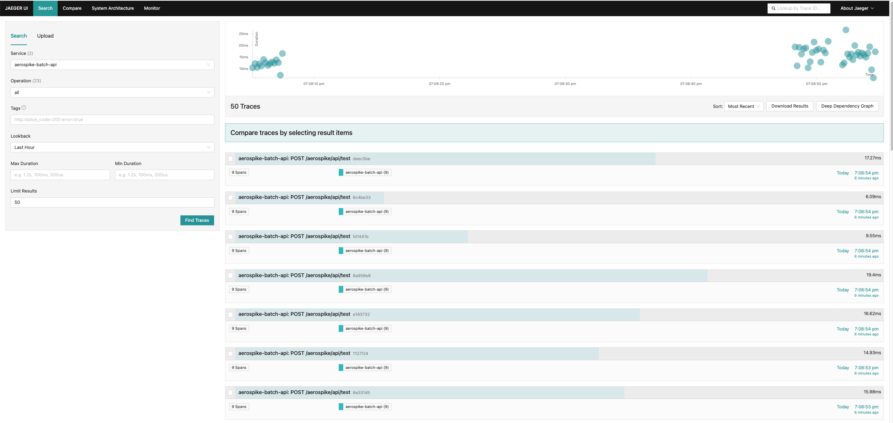
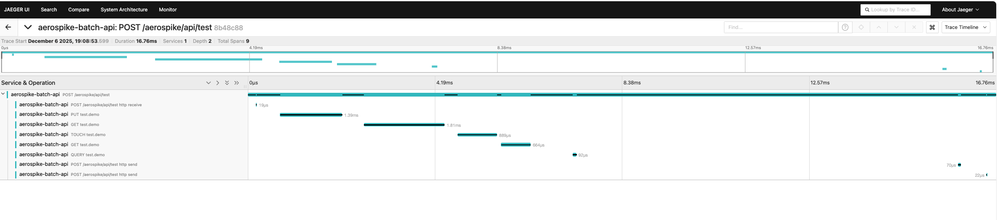

# Aerospike Client API

A FastAPI application demonstrating Aerospike operations with OpenTelemetry instrumentation.

## Features

- ✅ **CRUD Operations**: `put`, `get`, `touch`
- ✅ **Query with Secondary Index**: Automatic index creation
- ✅ **OpenTelemetry Tracing**: Full distributed tracing
- ✅ **Jaeger Integration**: Visualize traces in real-time

## Installation

```shell
# Start Aerospike, OTEL Collector, and Jaeger
docker compose -f compose.yaml up -d

# Install dependencies
uv sync

# Run server
uv run uvicorn main:app --reload --host 0.0.0.0 --port 8000
# or 
uv run python main.py
```

## Configuration

```python
AEROSPIKE_HOST = "127.0.0.1"
AEROSPIKE_PORT = 3000
AEROSPIKE_NAMESPACE = "test"
AEROSPIKE_SET = "demo"
```

## Secondary Indexes

The application automatically creates the following secondary indexes on startup:

- `idx_demo_age` - Numeric index on `age` bin
- `idx_demo_name` - String index on `name` bin
- `idx_demo_city` - String index on `city` bin

These indexes are required for query operations with `query.where()`.

## Endpoints

```
http://localhost:8000/docs     # FastAPI Swagger UI
http://localhost:16686/search  # Jaeger UI
```

### Example Request

```bash
curl -X POST "http://localhost:8000/aerospike/api/test" \
  -H "Content-Type: application/json" \
  -d '{
    "key": "test_user",
    "bins": {"name": "Test User", "age": 25, "city": "Seoul"},
    "query_bin": "age",
    "query_value": 25
  }'
```





